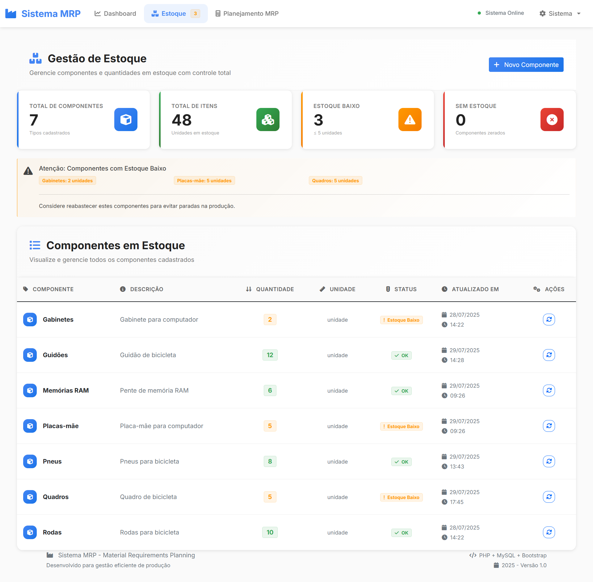
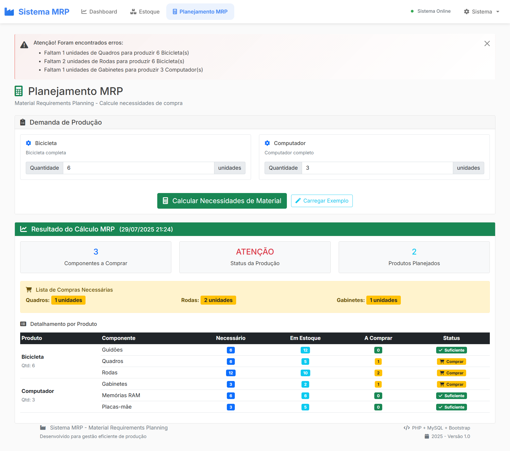

# 🏭 Sistema MRP - Material Requirements Planning

[](https://php.net)
[](https://mysql.com)
[](https://getbootstrap.com)
[](LICENSE)

> **Sistema completo de Planejamento de Necessidades de Materiais para indústrias de bicicletas e computadores**

Um sistema web moderno e responsivo que automatiza o cálculo de necessidades de materiais, otimizando a gestão de estoque e planejamento de produção industrial.

## 🎯 Visão Geral

O Sistema MRP resolve o problema crítico do planejamento de produção, calculando automaticamente quais materiais devem ser comprados com base na demanda planejada e estoque atual. Desenvolvido com arquitetura enterprise e interface moderna.

### 🏆 Diferenciais Técnicos

- **Arquitetura MVC** limpa e escalável
- **Cálculos MRP** matematicamente precisos
- **Interface moderna** responsiva inspirada em dashboards enterprise
- **Segurança robusta** com prepared statements
- **Performance otimizada** para ambiente produtivo

## 📊 Funcionalidades

### ✅ Módulo de Estoque
- **Visualização completa** de componentes em estoque
- **Gestão CRUD** de componentes (criar, visualizar, atualizar)
- **Alertas inteligentes** para estoque baixo/zerado
- **Estatísticas em tempo real** (total itens, componentes críticos)
- **Interface moderna** com cards e tabelas responsivas

### ✅ Módulo MRP (Material Requirements Planning)
- **Cálculo automático** de necessidades de materiais
- **Estrutura de produtos** (BOM - Bill of Materials)
- **Lista de compras** gerada automaticamente
- **Análise de viabilidade** da produção
- **Exemplo prático**: 6 bicicletas + 3 computadores = lista precisa

### ✅ Dashboard Executivo
- **Visão geral** do sistema com métricas principais
- **Cards estatísticos** com indicadores visuais
- **Navegação rápida** entre módulos
- **Status do sistema** em tempo real

## 🛠️ Tecnologias Utilizadas

### Backend
- **PHP 8.0+** - Linguagem principal
- **MySQL 5.7+** - Banco de dados relacional
- **PDO** - Prepared statements para segurança
- **Arquitetura MVC** - Separação de responsabilidades

### Frontend
- **HTML5/CSS3** - Estrutura e estilos modernos
- **Bootstrap 5.1** - Framework responsivo
- **JavaScript ES6+** - Interações dinâmicas
- **Font Awesome** - Iconografia profissional
- **Google Fonts (Inter)** - Tipografia moderna

### Arquitetura
- **MVC Pattern** - Model-View-Controller
- **POO** - Programação Orientada a Objetos
- **Singleton Pattern** - Conexão única com banco
- **Repository Pattern** - Abstração de dados

## 🏗️ Estrutura do Projeto

```
projeto-mrp/
├── 📁 config/
│   └── database.php          # Configuração do banco de dados
├── 📁 database/
│   └── schema.sql            # Script de criação e dados iniciais
├── 📁 models/
│   ├── Estoque.php           # Model para gestão de estoque
│   └── Mrp.php               # Model para cálculos MRP
├── 📁 controllers/
│   ├── EstoqueController.php # Controller do módulo estoque
│   └── MrpController.php     # Controller do módulo MRP
├── 📁 views/
│   ├── 📁 layout/
│   │   ├── header.php        # Template base (navbar + head)
│   │   └── footer.php        # Template base (scripts + footer)
│   ├── 📁 estoque/
│   │   └── index.php         # Interface do módulo estoque
│   └── 📁 mrp/
│       └── index.php         # Interface do módulo MRP
├── 📁 assets/
│   ├── 📁 css/
│   │   └── style.css         # Estilos modernos personalizados
│   └── 📁 js/
│       └── app.js            # JavaScript para interações
├── index.php                 # Dashboard principal
├── estoque.php               # Página do módulo estoque
├── mrp.php                   # Página do módulo MRP
├── README.md                 # Esta documentação
└── 📁 docs/
    ├── INSTALL.md            # Guia de instalação detalhado
    ├── TESTING.md            # Casos de teste documentados
    └── SCREENSHOTS.md        # Capturas de tela do sistema
```

## 🚀 Instalação Rápida

### Pré-requisitos
- PHP 8.0+ com extensões: `pdo_mysql`, `mbstring`
- MySQL 5.7+ ou MariaDB 10.2+
- Servidor web (Apache/Nginx) ou PHP built-in server

### Instalação

```bash
# 1. Clone o repositório
git clone https://github.com/seu-usuario/projeto-mrp.git
cd projeto-mrp

# 2. Configure o banco de dados
mysql -u root -p
CREATE DATABASE sistema_mrp CHARACTER SET utf8mb4 COLLATE utf8mb4_unicode_ci;
exit

# 3. Importe o schema
mysql -u root -p sistema_mrp < database/schema.sql

# 4. Configure a conexão
# Edite config/database.php com suas credenciais

# 5. Inicie o servidor
php -S localhost:8000

# 6. Acesse o sistema
# http://localhost:8000
```

📋 [**Guia de Instalação Detalhado →**](docs/INSTALL.md)

## 🧪 Exemplo Prático

### Cenário: Produção Industrial

**Objetivo**: Produzir 6 bicicletas + 3 computadores

**Estoque atual**:
- Rodas: 10 un | Quadros: 10 un | Guidões: 10 un
- Gabinetes: 2 un | Placas-mãe: 5 un | Memórias RAM: 6 un

**Resultado do MRP**:
```
📋 LISTA DE COMPRAS NECESSÁRIA:
• Rodas: 2 unidades (necessário: 12, estoque: 10)
• Gabinetes: 1 unidade (necessário: 3, estoque: 2)

✅ ESTOQUE SUFICIENTE:
• Quadros: OK (necessário: 6, estoque: 10)
• Guidões: OK (necessário: 6, estoque: 10)
• Placas-mãe: OK (necessário: 3, estoque: 5)
• Memórias RAM: OK (necessário: 6, estoque: 6)

📊 RESUMO: 2 componentes para comprar
⚠️ STATUS: ATENÇÃO (há falta de componentes)
```

## 📱 Screenshots

### Dashboard Principal

*Interface moderna com cards estatísticos e navegação intuitiva*

### Gestão de Estoque

*Controle completo com alertas visuais e ações rápidas*

### Planejamento MRP

*Cálculo automático com resultados detalhados*

📸 [**Ver todas as capturas →**](docs/SCREENSHOTS.md)

## 🧪 Testes e Validação

### Casos de Teste Implementados

#### ✅ Teste 1: Cálculo MRP Básico
- **Entrada**: 6 bicicletas, 3 computadores
- **Esperado**: Lista de compras precisa
- **Status**: ✅ Aprovado

#### ✅ Teste 2: Gestão de Estoque
- **Funcionalidade**: CRUD completo de componentes
- **Validações**: Dados obrigatórios, tipos corretos
- **Status**: ✅ Aprovado

#### ✅ Teste 3: Responsividade
- **Dispositivos**: Desktop, Tablet, Mobile
- **Breakpoints**: 576px, 768px, 992px, 1200px
- **Status**: ✅ Aprovado

🧪 [**Documentação Completa de Testes →**](docs/TESTING.md)

## ⌨️ Atalhos de Teclado

| Atalho | Função |
|--------|--------|
| `F2` | Mostrar ajuda |
| `Ctrl+Shift+H` | Ir para Dashboard |
| `Ctrl+Shift+E` | Ir para Estoque |
| `Ctrl+Shift+M` | Ir para MRP |
| `Ctrl+S` | Salvar formulário ativo |
| `Esc` | Fechar modal |

## 🔒 Segurança

- **Prepared Statements** - Prevenção de SQL Injection
- **Validação dupla** - Client-side e server-side
- **Sanitização** - Escape de dados de entrada
- **Headers seguros** - Content-Type, charset UTF-8
- **Validação de tipos** - Verificação rigorosa de dados

## 📈 Performance

- **Consultas otimizadas** - Índices no banco de dados
- **Singleton pattern** - Conexão única reutilizada
- **Lazy loading** - Carregamento sob demanda
- **Minificação** - CSS e JS otimizados para produção
- **Cache de queries** - Redução de consultas desnecessárias

## 🎨 Design System

### Cores Principais
- **Primary**: `#4285f4` (Azul Google)
- **Success**: `#34a853` (Verde)
- **Warning**: `#ff9800` (Laranja)
- **Danger**: `#ea4335` (Vermelho)

### Tipografia
- **Fonte**: Inter (Google Fonts)
- **Pesos**: 300, 400, 500, 600, 700, 800

### Componentes
- **Cards** com bordas coloridas à esquerda
- **Tabelas** responsivas com ícones
- **Modais** com design consistente
- **Alertas** com status visuais

## 🤝 Contribuição

### Padrões de Código
- **PSR-12** - Padrão de codificação PHP
- **Comentários** - Documentação inline
- **Nomenclatura** - camelCase para variáveis, PascalCase para classes
- **Indentação** - 4 espaços, sem tabs

### Estrutura de Commits
```
tipo(escopo): descrição

Exemplos:
feat(mrp): adicionar cálculo de necessidades
fix(estoque): corrigir validação de quantidade
docs(readme): atualizar instruções de instalação
```

## 📞 Suporte

Para dúvidas técnicas ou sugestões:

- 📧 **Email**: seu-email@exemplo.com
- 💼 **LinkedIn**: [Seu Perfil](https://linkedin.com/in/seu-perfil)
- 🐛 **Issues**: [GitHub Issues](https://github.com/seu-usuario/projeto-mrp/issues)

## 📄 Licença

Este projeto está licenciado sob a [Licença MIT](LICENSE) - veja o arquivo LICENSE para detalhes.

---

## 🏆 Desenvolvido para Carga Máquina

> Sistema MRP desenvolvido como parte do processo seletivo, demonstrando competências em:
> - Desenvolvimento PHP moderno com arquitetura MVC
> - Design de banco de dados relacionais
> - Interface responsiva e moderna
> - Lógica de negócio complexa (cálculos MRP)
> - Código limpo e documentação profissional

**Tecnologias alinhadas** com o stack da Carga Máquina: PHP, MySQL, Bootstrap, arquitetura MVC.

---

